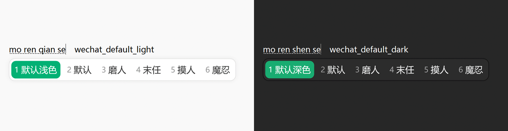
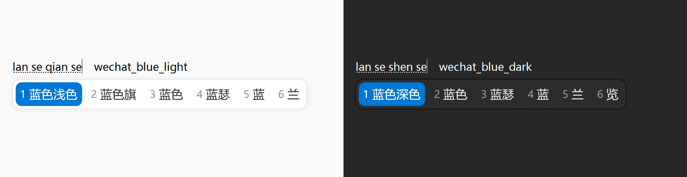

# 微信输入法风格小狼毫主题

微信输入法风格的 Rime（Weasel）版皮肤。横排候选、嵌入式编码、浅色 / 深色模式各两套配色。

## 配色

wechat_default_light / wechat_default_dark

wechat_blue_light / wechat_blue_dark

## 安装

1. 把 `weasel.custom.yaml` 复制到 Rime 用户目录（默认 `%APPDATA%\Rime`，实际路径可在「小狼毫输入法设定」中查看）
2. 重新部署：右键任务栏小狼毫图标 →「重新部署」
3. 深色自动切换需 0.16+（Windows 10 1809+），推荐 0.17+

## 切换配色

**修改 weasel.custom.yaml 文件**：
- `style/color_scheme` 选浅色（`wechat_default_light` / `wechat_blue_light`）
- `style/color_scheme_dark` 选深色（`wechat_default_dark` / `wechat_blue_dark`）
- 改完重新部署。系统切换至深色模式时会自动切换到深色配色
  
## 致谢

设计参考微信输入法候选条样式。本项目为非官方个人作品，与腾讯 / 微信官方无关。

## License

MIT
